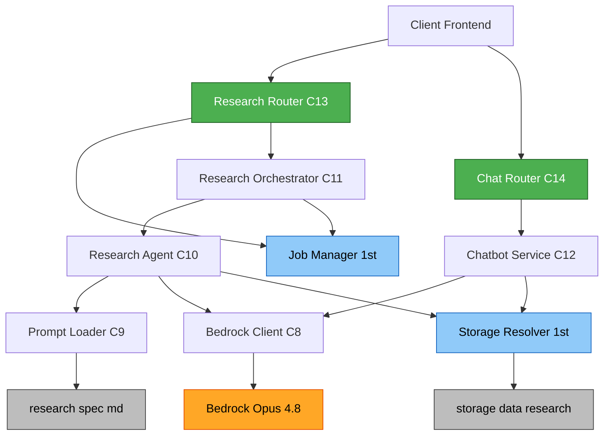

# Component Dependencies — research-chatbot (2차)

## 의존 매트릭스 (행 → 열 호출)
| ↓ \ → | ResearchRouter | ChatRouter | ResearchOrch | ResearchAgent | Chatbot | BedrockClient | PromptLoader | JobMgr(1차) | StorageResolver(1차) | Bedrock |
|---|:--:|:--:|:--:|:--:|:--:|:--:|:--:|:--:|:--:|:--:|
| **ResearchRouter** | – | – | ✔(BG) | – | – | – | – | ✔ | – | – |
| **ChatRouter** | – | – | – | – | ✔ | – | – | – | – | – |
| **ResearchOrch** | – | – | – | ✔ | – | – | – | ✔(progress) | – | – |
| **ResearchAgent** | – | – | – | – | – | ✔ | ✔ | – | ✔(save) | – |
| **Chatbot** | – | – | – | – | – | ✔ | – | – | ✔(exists) | – |
| **BedrockClient** | – | – | – | – | – | – | – | – | – | ✔ |

- 방향: Router → Service → (BedrockClient → Bedrock). 순환 없음.
- 1차 컴포넌트(JobMgr·StorageResolver)는 **피호출만**(확장된 채로 재사용).
- BedrockClient만 외부 Bedrock에 의존(격리).

## 데이터 흐름 (리서치, 텍스트)
```
POST /api/research/{domain}/{id}
 → ResearchRouter → JobMgr.create_job → BG: ResearchOrch.run_research_job
     → ResearchAgent.run
         → PromptLoader(prompt+schema)
         → BedrockClient.generate_structured → Bedrock(Opus 4.8) → JSON
         → StorageResolver.save_research → storage/data/research/<domain>/<id>/
     → JobMgr.succeed(result)
GET /api/jobs/{id} → JobStatus(progress/result)
```

## 컴포넌트 관계도 (Mermaid)


### Text Alternative
```
Client → {ResearchRouter, ChatRouter}
ResearchRouter → JobManager(1차), ResearchOrchestrator
ChatRouter → ChatbotService
ResearchOrchestrator → ResearchAgent, JobManager(progress)
ResearchAgent → PromptLoader, BedrockClient, StorageResolver(1차)
ChatbotService → BedrockClient, StorageResolver(1차)
BedrockClient → Bedrock(Opus 4.8)
PromptLoader → architecture/research/*.md
StorageResolver → storage/data/research/
(단방향, 순환 없음)
```

## 외부 의존 (requirements.txt 반영)
- anthropic==0.109.2 (AnthropicBedrockMantle) — 신규 명시
- boto3==1.42.97 (자격증명 체인, 1차에서 이미 핀)
- (테스트) pytest·hypothesis·httpx (1차)
