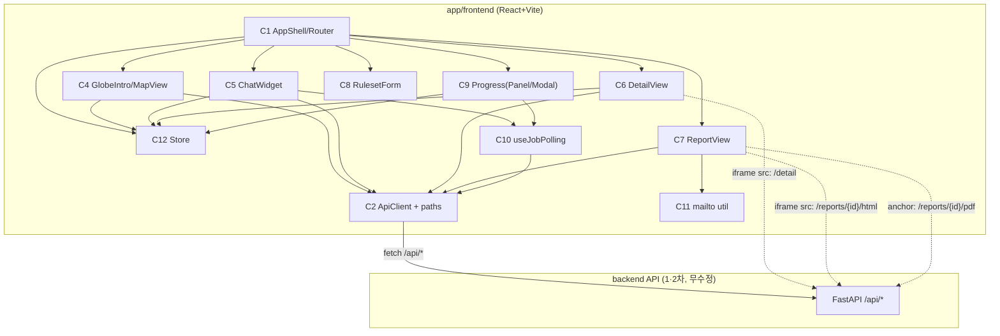

# Component Dependencies — frontend (3차)

> Application Design 산출물 ④. 의존 매트릭스·통신 패턴·데이터 흐름.

## 1. 의존 매트릭스 (행 → 열 의존)

| ↓의존 \ 대상→ | C1 Shell | C2 Api | C3 Tokens | C4 Map | C5 Chat | C6 Detail | C7 Report | C8 Ruleset | C9 Progress | C10 Poll | C11 mailto | C12 Store |
|---|---|---|---|---|---|---|---|---|---|---|---|---|
| C1 AppShell | — | | ✓ | ✓ | ✓ | ✓ | ✓ | ✓ | ✓ | | | ✓ |
| C2 ApiClient | | — | | | | | | | | | | |
| C4 Map | | ✓ | ✓ | — | | | | | | | | ✓ |
| C5 Chat | | ✓ | ✓ | | — | | | | | ✓ | | ✓ |
| C6 Detail | | ✓ | ✓ | | | — | | | | | | ✓ |
| C7 Report | | ✓ | ✓ | | | | — | | | | ✓ | ✓ |
| C8 Ruleset | | (✓) | ✓ | | | | | — | | | | |
| C9 Progress | | ✓ | ✓ | | | | | | — | ✓ | | ✓ |
| C10 Poll | | ✓ | | | | | | | | — | | |
| C11 mailto | | | | | | | | | | | — | |

- **C2 ApiClient**: 무의존(순수 HTTP 레이어) — 가장 안정적, 모두가 의존.
- **C3 Tokens**: 모든 시각 컴포넌트가 의존(시맨틱 클래스). 코드 의존 아닌 빌드 시 Tailwind.
- **C11 mailto**: 순수 함수, 무의존 → 테스트 용이.
- **C10 useJobPolling**: C2만 의존, C5·C9가 소비(Q4=A 공용).
- **C8 (✓)**: 룰셋 초기값 참고용 약한 의존(저장 API 부재, Q5=A).

## 2. 통신 패턴 (mermaid)

- 실선 = JS 호출(fetch/JSON·상태 구독). 점선 = 브라우저 직접 로드(iframe src·anchor download) — JS fetch 거치지 않음(PIPELINE §5).

## 3. 데이터 흐름 요약
1. **카탈로그/마커**: APIsrv → C2 → C4(지도 마커)
2. **상세 표시**: C6 chrome(React) + iframe(브라우저가 detail HTML 직접 로드)
3. **보고서 생성**: C6 → C2.createReport(202) → C12 잡 등록 → C10 폴링 → C9 진행 → done → C7
4. **보고서 embed**: C7 chrome + iframe(report html 직접 로드) + C11 mailto / anchor pdf
5. **챗봇·리서치**: C5 → C2.chat → (needs_research) → C2.triggerResearch(202) → C10 → 복귀
6. **인트로**: C4 GlobeIntro → (onDone) → MapView (딥링크 시 스킵)

## 4. 빌드/업데이트 순서 (Code Generation 단계 가이드)
공통 기반 먼저 → 화면 컴포넌트:
1. 스캐폴드(Vite+TS+Tailwind C3 + vite proxy) → 2. C2 ApiClient + 타입 → 3. C1 Shell/Router + C12 Store → 4. C4 GlobeIntro/MapView → 5. C6 Detail / C7 Report (iframe embed) → 6. C5 Chat + C10 Poll + C9 Progress → 7. C8 Ruleset + C11 mailto → 8. Vitest(C2 경로빌더·C11 mailto 단위 + 컴포넌트 스모크)

## 5. 순환 의존 점검
- 순환 없음. C2/C3/C11은 leaf(무의존), C10은 C2만 의존, C1이 최상위 조립자. Store(C12)는 양방향 구독이나 컴포넌트→store 단방향 의존(pub/sub)으로 순환 아님.
