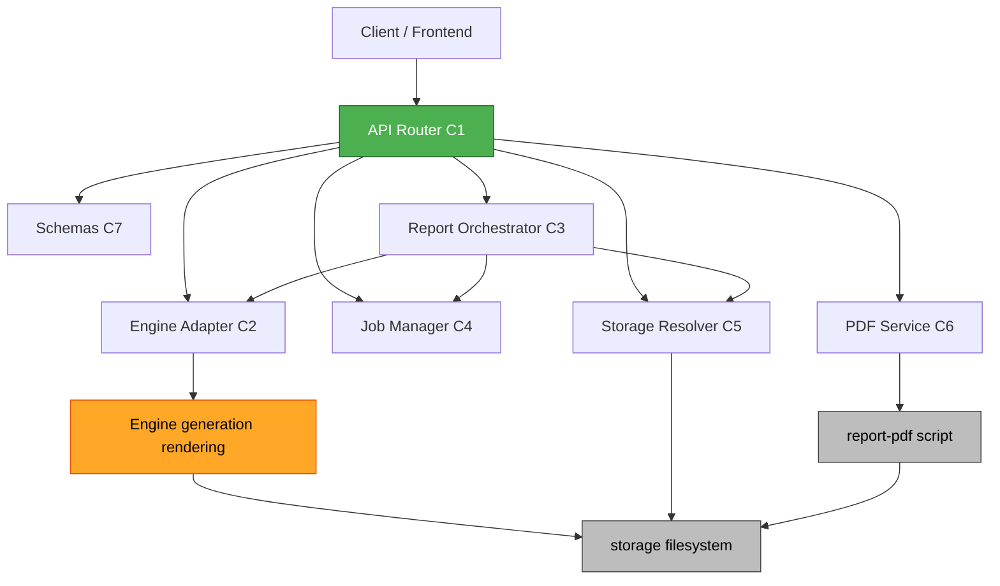

# Component Dependencies — backend-api (1차)

## 의존 매트릭스 (행 → 열을 호출/의존)

| ↓호출 \ 피호출→ | Router | Adapter | Orchestrator | JobMgr | Resolver | PDF | Schemas | Engine(기존) |
|---|:--:|:--:|:--:|:--:|:--:|:--:|:--:|:--:|
| **Router** | – | ✔(detail) | – | ✔ | ✔ | ✔ | ✔ | – |
| **Adapter** | – | – | – | – | (경로 주입받음) | – | – | ✔ |
| **Orchestrator** | – | ✔ | – | (progress_cb) | ✔ | – | – | – |
| **JobMgr** | – | – | – | – | – | – | ✔ | – |
| **Resolver** | – | – | – | – | – | – | ✔ | – |
| **PDF** | – | – | – | – | – | – | – | (report-pdf 스크립트) |

- 의존 방향은 **Router → Services → Engine** 단방향(순환 없음).
- Adapter만 기존 `engine/`에 의존(격리). 다른 서비스는 Adapter/Resolver를 통해 간접 사용.
- Orchestrator는 Job Manager에 **콜백으로만** 진행 보고(역방향 강결합 없음).

## 통신 패턴
- 전부 **in-process 함수 호출**(Q1=A). 네트워크/IPC 없음.
- PDF Service만 report-pdf 스크립트를 import 또는 subprocess로 호출.
- 비동기는 FastAPI `BackgroundTasks`(같은 프로세스).

## 데이터 흐름 (보고서 생성, 텍스트)
```
HTTP POST /reports
  → Router (검증)
  → JobMgr.create_job() ──> job_id
  → BackgroundTasks: Orchestrator.run_report_pipeline(domain,id)
        → Adapter.generate_report_json() → Engine(generation) → storage/report/.../data/RPT_*.json
        → Adapter.render_report_html()   → Engine(rendering)  → storage/report/.../html/RPT_*.html
        → Resolver.to_url() → 상대 URL
        → JobMgr.succeed(result={report_id, json_url, html_url})
HTTP GET /jobs/{id}
  → Router → JobMgr.get_job() → JobStatus(progress/result)
```

## 컴포넌트 관계도 (Mermaid)



### Text Alternative
```
Client → Router
Router → {Schemas, JobMgr, Resolver, Adapter, PDF, Orchestrator}
Orchestrator → {Adapter, Resolver, JobMgr(progress)}
Adapter → Engine(generation/rendering) → storage
Resolver → storage
PDF → report-pdf script → storage
(의존 방향 단방향, 순환 없음)
```

## 외부 의존 (requirements.txt 반영)
- fastapi, uvicorn (앱·서버)
- pydantic (schemas)
- jinja2 (엔진 렌더 의존 — 기존)
- weasyprint (PDF)
- boto3, requests (2차 대비, 기설치 핀)
- hypothesis (PBT-09, 테스트)
