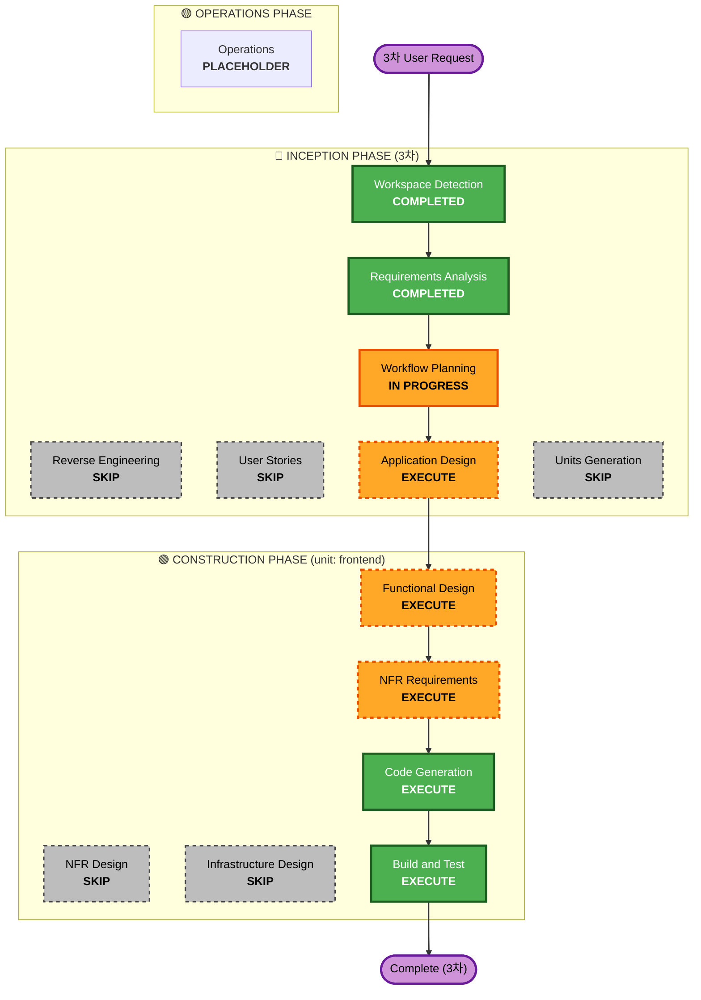

# Execution Plan — 3차: 프론트엔드 (React + Vite)

## Detailed Analysis Summary

### Transformation Scope (Brownfield)
- **Transformation Type**: Application change (신규 레이어 추가) — `app/frontend/`에 React+Vite 클라이언트 신규 구현. 백엔드(1·2차)·엔진 **무수정**.
- **Primary Changes**: `app/frontend/` 전체 신규 — 앱 셸·라우팅·API 클라이언트, D3 지구본 인트로 + M1 지도, C1 챗봇 위젯, P1/P2·PR1/PR2 iframe embed + chrome, PS1 룰셋·PS2 프로그레스, mailto 이메일 유틸, Vitest 경량 테스트, `package.json`·`vite.config`·Tailwind 설정.
- **Related Components**: 1차 backend-api(카탈로그·존재·상세·리포트·잡 폴링·PDF), 2차(리서치 트리거·챗봇) API를 **소비만** 한다(서버측 무변경). 디자인 SoT는 확정.

### Change Impact Assessment
- **User-facing changes**: **Yes** — 이 차수가 곧 사용자 대면 UI 전체(지도·챗봇·상세·보고서·설정).
- **Structural changes**: **Yes** — 신규 프론트엔드 스택(React+Vite+TS+Tailwind+D3) 도입. 백엔드 구조는 불변.
- **Data model changes**: **No** — 기존 API JSON·HTML/PDF URL 계약을 그대로 소비. 신규는 프론트 내부 뷰모델·라우팅 상태뿐.
- **API changes**: **소규모 Yes (Functional Design에서 확정)** — 당초 "신규 엔드포인트 불필요"였으나, 사용자 결정으로 **상세화면 렌더링을 비동기 폴링 잡으로 확장**(`POST .../detail` 202 + detail orchestrator, 1·2차 동형). 그 외(카탈로그·보고서·리서치·잡 폴링·챗봇)는 기존으로 충족. 이메일은 클라이언트 `mailto:` 위임(서버 발송 없음). **PDF SES 첨부 발송은 3차 제외 — 신규 요구사항으로 별도 범위 분리**(ROADMAP 횡단/4차).
- **NFR impact**: **Yes** — 반응형·접근성(키보드·`prefers-reduced-motion`·iframe title)·성능(코드 스플리팅·60fps 지향). 보안/복원력 opt-out 유지, PBT는 백엔드 전용(프론트 경량 Vitest).

### Component Relationships (Brownfield)
- **Primary Component(신규)**: `app/frontend/` — 앱 셸·API 클라이언트·8화면 컴포넌트·D3 지도/인트로·챗봇·이메일 유틸
- **Dependent on(소비, 무수정)**:
  - 1차 backend-api — `GET /api/{countries,regions}`(카탈로그·존재), `.../detail`, 리포트 `POST/GET .../reports[/{id}/{json,html,pdf}]`, 잡 `GET /api/jobs/{id}`
  - 2차 research-chatbot — 리서치 `POST .../research`(비동기 잡), 챗봇 `POST /api/chat`(동기)
- **Design SoT(참조, 변경 금지)**: `web_design_spec.md`(8화면·진입모드·6.x 플로우), `intro_spec.md`(D3 지구본 인트로), `DESIGN.md`(Kinetic Enterprise 팔레트), stitch mockup 8종, `PIPELINE.md` §1/§5(iframe embed + chrome만 React)
- **Supporting(스킬, 코드 생성 아님)**: `frontend-design`(2-pass 충실도·품질 게이트), `ui-ux-pro-max`(접근성·차트 검증 보조)

### Risk Assessment
- **Risk Level**: **Medium-High** — 단일 차수 최대 범위(8화면 전체 + D3 시네마틱 인트로 + 인터랙티브 지도 + 비동기 잡 폴링 + iframe embed + 진입 모드 2종). 신규 스택 전체. 단 디자인 SoT 확정·백엔드 API 가동 확인으로 불확실성은 표면적 구현에 한정.
- **Rollback Complexity**: **Easy~Moderate** — 신규 디렉터리(`app/frontend/`) 단독 + 백엔드 소규모 확장(detail 잡, 기존 동기 GET 보존하는 추가 경로). 폴더 단위 롤백 + 백엔드 추가분 분리 가능.

> **범위 변경 노트 (Functional Design 3차에서 확정)**: ① 상세화면 렌더링을 **비동기 폴링 잡으로 백엔드 확장** 포함(당초 "백엔드 무수정"에서 변경). ② PDF **SES 첨부 발송은 3차 제외**, 신규 요구사항으로 분리(3차 프론트는 명세 §6.6대로 mailto 링크+첨부 안내 유지).
- **Testing Complexity**: **Moderate** — 빌드·타입체크 게이트 + Vitest 경량(핵심 유틸 단위 + 컴포넌트 스모크). E2E는 dev proxy로 백엔드 연동 스모크.

## Workflow Visualization

## Phases to Execute

### 🔵 INCEPTION PHASE (3차)
- [x] Workspace Detection — COMPLETED (동일 brownfield, RE 생략 유지)
- [x] Reverse Engineering — SKIPPED (설계 명세·1·2차 산출물 충실)
- [x] Requirements Analysis — COMPLETED (requirements-3.md, 결정 7건 전부 A, 승인 완료)
- [x] User Stories — SKIPPED
  - **Rationale**: 화면·플로우·페르소나가 `web_design_spec.md` §6 + stitch mockup 8종 + `intro_spec.md`로 이미 SoT 확정. 별도 스토리는 중복.
- [x] Workflow Planning — IN PROGRESS (본 문서)
- [ ] Application Design — **EXECUTE**
  - **Rationale**: Q1=A로 8화면 전체+D3 인트로가 한 차수 → **컴포넌트 분해·전환(라우팅) 책임·진입 모드 2종·iframe embed chrome 경계·API 클라이언트 추상화**를 설계해 작업량을 관리해야 함. 화면 전환 흐름(web_design_spec §6·PIPELINE §1) 이 단계에서 컴포넌트 구조로 반영.
- [ ] Units Generation — **SKIP**
  - **Rationale**: 단일 응집 단위 `frontend`. 컴포넌트 분해는 Application Design에서 다룸(별도 unit 분리 불필요).

### 🟢 CONSTRUCTION PHASE (unit: frontend)
- [ ] Functional Design — **EXECUTE**
  - **Rationale**: 상태 전이(인트로→지도→팝업/풀사이즈 진입 모드), 잡 폴링 상태머신(보고서 생성·리서치), 챗봇 §6.5 분기, mailto URL 조립 규칙, API 경로 빌더 계약 등 **로직** 정의.
- [ ] NFR Requirements — **EXECUTE (경량)**
  - **Rationale**: 반응형 브레이크포인트·접근성(키보드·`prefers-reduced-motion`·iframe title·색+아이콘 병행)·성능(코드 스플리팅·60fps)·품질 게이트(빌드·타입체크·Vitest·frontend-design 2-pass)·의존성 버전 핀(React/Vite/TS/Tailwind/D3/Vitest).
- [ ] NFR Design — **SKIP** (NFR 경량, 상위 설계 흡수)
- [ ] Infrastructure Design — **SKIP** (배포 4차/deploy 스킬)
- [ ] Code Generation — **EXECUTE (ALWAYS)**
  - **Rationale**: 단계적 생성 — ① 스캐폴드(Vite+TS+Tailwind+토큰 매핑·dev proxy·API 클라이언트) → ② D3 인트로+M1 지도 → ③ 진입 모드 셸·라우팅 → ④ P1/P2·PR1/PR2 iframe embed + chrome → ⑤ C1 챗봇(분기·잡 폴링) → ⑥ PS1 룰셋·PS2 프로그레스 → ⑦ mailto 유틸. frontend-design 2-pass·ui-ux-pro-max 검증 보조 활용.
- [ ] Build and Test — **EXECUTE (ALWAYS)**
  - **Rationale**: `vite build`·`tsc` 타입체크 게이트, Vitest 경량(mailto URL 조립·API 경로 빌더 단위 + 컴포넌트 스모크), dev proxy로 백엔드 연동 스모크.

### 🟡 OPERATIONS PHASE
- [ ] Operations — PLACEHOLDER (배포 4차/deploy 스킬)

## Unit of Work
- **단일 단위**: `frontend` — React+Vite+TS+Tailwind 앱: 앱 셸·라우팅·API 클라이언트 + D3 인트로/M1 지도 + C1 챗봇 + P1/P2·PR1/PR2 iframe embed + PS1/PS2 + mailto 유틸 + Vitest 경량 테스트.

## Module Update Strategy (단일 모듈, 내부 빌드 순서)
- **Update Approach**: Sequential(프론트 내부 단계) — 백엔드 무수정이므로 모듈 간 조정 없음.
- **Critical Path**: 스캐폴드/토큰/API 클라이언트(공통 기반) → 화면 컴포넌트들.
- **Coordination Points**: 1·2차 API 계약(`to_url` 경로 규칙·잡 폴링·챗봇/리서치)과 정합 — 백엔드 가동 상태에서 dev proxy 스모크.
- **Testing Checkpoints**: 스캐폴드 후 빌드/타입체크, 유틸 생성 후 Vitest, 통합 단계에서 백엔드 연동 스모크.

## Estimated Timeline
- **Stages to Execute**: 5 (Application Design, Functional Design, NFR Requirements(경량), Code Generation, Build & Test)
- **Stages to Skip**: 5 (Reverse Engineering, User Stories, Units Generation, NFR Design, Infrastructure Design)
- **참고**: Q1=A(8화면 전체+D3 인트로)로 Code Generation이 가장 큰 비중 — 7개 하위 단계로 분할 진행.

## Success Criteria
- **Primary Goal**: `web_design_spec.md` 8화면 + D3 지구본 인트로가 React+Vite 앱으로 동작하고, 1·2차 API와 실제 연동(Vite dev proxy)되어 카탈로그→상세→보고서 생성(잡 폴링)→보고서 embed·PDF·메일 공유, 챗봇 §6.5 분기→리서치 흐름이 end-to-end로 작동.
- **Key Deliverables**:
  - `app/frontend/` React+Vite+TS 앱, `package.json`·`vite.config`(dev proxy)·`tailwind.config`(Kinetic Enterprise 토큰 매핑)
  - D3 지구본 시네마틱 인트로 + 인터랙티브 M1 지도(드래그/줌/포커스/마커/범례)
  - C1 챗봇 위젯(§5.2 위치 규칙·§6.5 needs_research 분기·잡 폴링)
  - P1/P2 상세·PR1/PR2 보고서 iframe embed + chrome(헤더·버튼·진입 모드 2종)
  - PS1 룰셋 설정 폼(3패널)·PS2 프로그레스(5바·잡 폴링·카드형)
  - mailto URL 조립 유틸(무저장·첨부 안내) + [메일 발송] 버튼
  - API 클라이언트 모듈(경로 빌더·잡 폴링·리서치·챗봇), Vitest 경량 테스트
- **Quality Gates**: `vite build` 성공 · `tsc` 타입체크 통과 · Vitest 경량 통과 · frontend-design 2-pass(토큰 이식→mockup 충실도) · ui-ux-pro-max 접근성 체크 · 디자인 SoT 무변경 · 백엔드 무수정 · dev proxy 연동 스모크 1회 성공
- **Integration Testing**: 카탈로그 → 상세(P1/P2) → 보고서 생성 잡 폴링 → PR1/PR2 embed → PDF/메일, 챗봇 분기 → 리서치 잡 → 데이터 기반 답변 흐름(백엔드 가동 상태)
