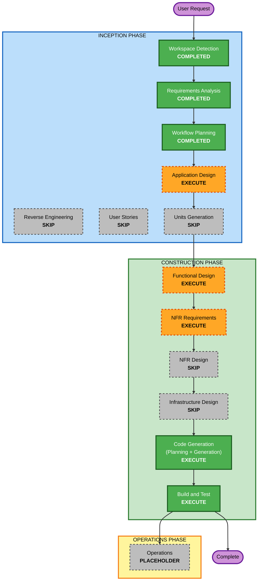

# Execution Plan — 1차: 백엔드 API + 진단 파이프라인 정합화

## Detailed Analysis Summary

### Transformation Scope (Brownfield)
- **Transformation Type**: Application change (신규 API 레이어 추가 + 기존 엔진 정합화). 인프라/배포 변경 없음(4차로 분리).
- **Primary Changes**: `app/backend/`에 FastAPI 앱 신규 구축, 기존 generation/rendering 엔진을 in-process import로 연결.
- **Related Components**: 기존 엔진(`engine/generation/*`, `engine/rendering/*`)은 **무수정 호출 대상**(어댑터로 감쌈). `storage/` 경로 규칙 준수.

### Change Impact Assessment
- **User-facing changes**: Yes(간접) — 프론트(3차)가 호출할 API 계약 신설. 1차 자체는 UI 없음.
- **Structural changes**: Yes — 신규 API 레이어(`app/backend/api/`) 추가. 엔진 구조는 불변.
- **Data model changes**: No — 리포트 JSON/리서치 스키마 불변. 신규는 API 요청/응답·잡 상태 모델만.
- **API changes**: Yes — HTTP 엔드포인트 신설(조회·생성트리거·잡상태·산출물·PDF).
- **NFR impact**: Yes(경량) — 비동기 잡 처리, 테스트(PBT Partial). 보안/복원력은 opt-out.

### Component Relationships (Brownfield)
- **Primary Component**: 신규 `app/backend/api/` (FastAPI 앱)
- **Shared/호출 대상**: `engine/generation/country_report_engine.py`·`region_report_engine.py`, `engine/rendering/{country,region}_{report,detail}_renderer.py`
- **Supporting Components**: `storage/`(I/O), `report-pdf` 스킬 로직(weasyprint)
- **Dependent Components**: (미래) 프론트(3차)·챗봇(2차)
- 변경 유형: 신규 API = Major(신규), 엔진 = 무변경(Configuration-only 수준의 호출만)

### Risk Assessment
- **Risk Level**: **Medium** — 다수 엔드포인트·비동기 잡 관리 신규이나, 핵심 계산 로직(엔진)은 검증된 기존 자산 재사용.
- **Rollback Complexity**: Easy — 신규 디렉토리 추가 위주, 기존 엔진 무수정.
- **Testing Complexity**: Moderate — API 통합 테스트 + 엔진 어댑터 + PBT(직렬화·불변식).

## Workflow Visualization



### Text Alternative (always included)
```
INCEPTION PHASE
- Workspace Detection ........ COMPLETED
- Reverse Engineering ........ SKIP (설계 문서 충실)
- Requirements Analysis ...... COMPLETED
- User Stories ............... SKIP (API 정합화, 사용자 페르소나 불요)
- Workflow Planning .......... COMPLETED (현재)
- Application Design ......... EXECUTE
- Units Generation ........... SKIP (단일 backend-api 단위)

CONSTRUCTION PHASE (unit: backend-api)
- Functional Design .......... EXECUTE
- NFR Requirements ........... EXECUTE (경량: 비동기 + PBT 프레임워크)
- NFR Design ................. SKIP (NFR 경량, 상위 설계에 흡수)
- Infrastructure Design ...... SKIP (배포 4차)
- Code Generation ............ EXECUTE
- Build and Test ............. EXECUTE

OPERATIONS PHASE
- Operations ................. PLACEHOLDER (배포는 deploy 스킬/4차)
```

## Phases to Execute

### 🔵 INCEPTION PHASE
- [x] Workspace Detection (COMPLETED)
- [x] Reverse Engineering (SKIPPED) — 설계 명세·README가 충실해 전체 역공학 불필요(필요한 엔진 구조는 직접 확인 완료)
- [x] Requirements Analysis (COMPLETED)
- [x] User Stories (SKIPPED) — 내부 API 정합화 작업, 다중 페르소나·수용기준 불요. 화면 명세는 `web_design_spec.md`가 이미 보유
- [x] Execution Plan (IN PROGRESS)
- [ ] Application Design — **EXECUTE**
  - **Rationale**: 신규 컴포넌트(FastAPI 라우터, 엔진 어댑터, 잡 매니저, PDF 서비스)와 서비스 계층·의존 관계 정의 필요
- [ ] Units Generation — **SKIP**
  - **Rationale**: 1차는 단일 응집 백엔드 API 모듈(unit: `backend-api`). 병렬 분해할 다중 패키지 없음

### 🟢 CONSTRUCTION PHASE (unit: backend-api)
- [ ] Functional Design — **EXECUTE**
  - **Rationale**: 엔드포인트 계약, 잡 상태 머신, country/region 오케스트레이션 흐름, 요청/응답 모델 상세 설계. PBT-01 속성 식별(advisory) 포함
- [ ] NFR Requirements — **EXECUTE (경량)**
  - **Rationale**: 비동기 잡 처리 전략 + **PBT 프레임워크 선정(Hypothesis)** 문서화 — PBT-09(강제) 충족 위치
- [ ] NFR Design — **SKIP**
  - **Rationale**: Security/Resiliency opt-out, NFR 범위 경량. 잡 동시성·에러 핸들링은 Functional/Application Design에 흡수
- [ ] Infrastructure Design — **SKIP**
  - **Rationale**: 배포(Docker/ECR/CFN)는 ROADMAP 4차, deploy 스킬이 담당
- [ ] Code Generation — **EXECUTE (ALWAYS)**
  - **Rationale**: API 구현·PBT 포함 테스트·requirements.txt 생성
- [ ] Build and Test — **EXECUTE (ALWAYS)**
  - **Rationale**: 빌드/서버 기동·통합 테스트·PBT(seed 로깅) 실행

### 🟡 OPERATIONS PHASE
- [ ] Operations — PLACEHOLDER (배포는 별도 deploy 스킬/4차)

## Unit of Work
- **단일 단위**: `backend-api` — FastAPI 앱 + 엔진 어댑터 + 잡 매니저 + PDF 서비스 + 테스트

## Estimated Timeline
- **Total Stages to Execute**: 5 (Application Design, Functional Design, NFR Requirements, Code Generation, Build & Test)
- **Estimated Duration**: 세션 내 순차 진행(스테이지별 승인 게이트)

## Success Criteria
- **Primary Goal**: 프론트가 호출 가능한 country/region 대칭 FastAPI 백엔드 + 비동기 보고서 생성 파이프라인 동작
- **Key Deliverables**:
  - `app/backend/api/` FastAPI 앱(엔드포인트: 조회·존재확인·상세화면 HTML·보고서 생성트리거·잡상태·산출물 JSON/HTML·PDF)
  - 엔진 in-process 어댑터(country/region 대칭 오케스트레이션)
  - 비동기 잡 매니저(job_id 발급·상태 폴링)
  - `requirements.txt`(버전 핀 + Hypothesis)
  - 테스트(통합 + PBT Partial)
- **Quality Gates**:
  - `python3 -m py_compile` 통과(전 신규 파일)
  - 서버 기동 + 핵심 엔드포인트 스모크 테스트 통과
  - PBT Partial 준수(PBT-02·03·07·08·09)
  - storage 경로·네이밍 규칙 위반 없음, 기존 엔진 무파괴
- **Integration Testing**: API ↔ 엔진 ↔ storage 산출물 흐름(생성→조회) 검증
