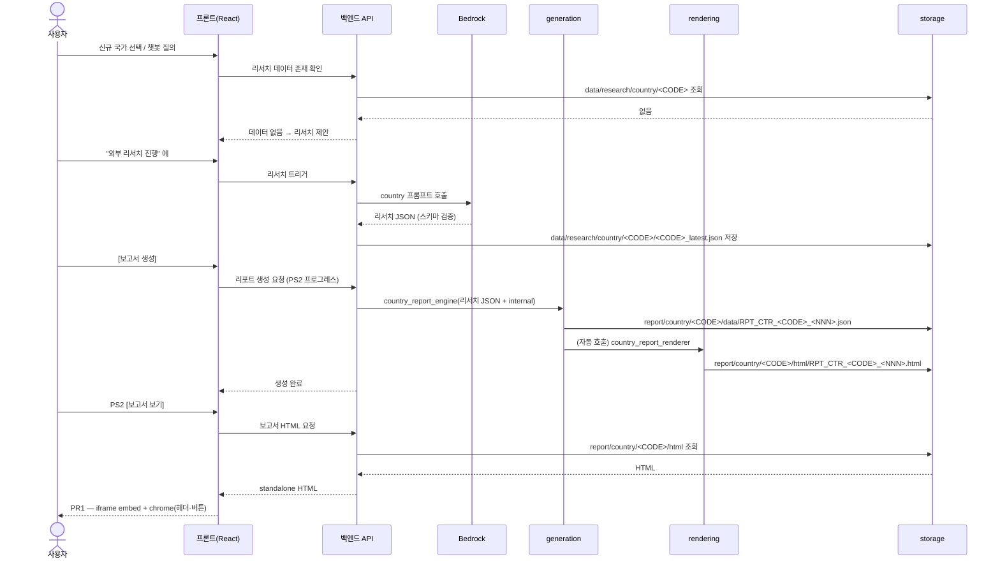
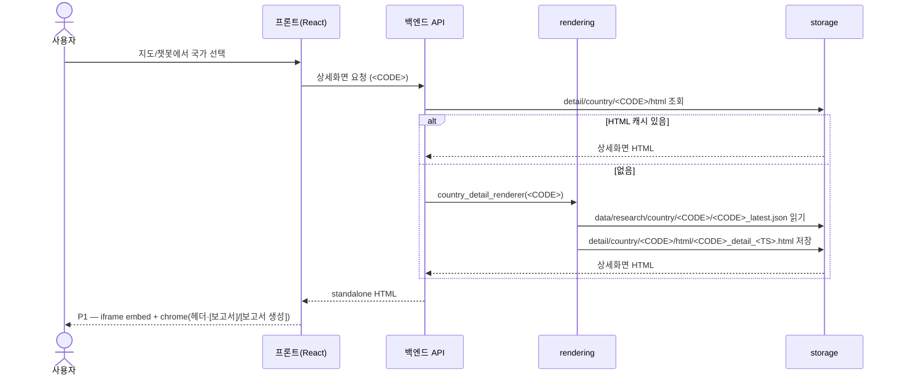

# 파이프라인 & 흐름 명세

silk-road의 **런타임 흐름**과 **산출물 라인**을 정의한다.
화면 정적 명세(화면별 구성·진입 모드)는 `design/design_spec/web_design_spec.md`가 source of truth이고,
이 문서는 그 화면들이 **어떤 데이터·산출물을 소비/생성하며 어떻게 이어지는지**(end-to-end)를 담당한다.

> 엔진 내부 규칙은 중복 작성하지 않는다. 생성/렌더 엔진의 상세 규칙은 아래 명세를 참조:
> - 리포트 생성: [`research/report_generate_req.md`](research/report_generate_req.md)
> - 보고서 렌더링: [`research/report_render_req.md`](research/report_render_req.md)
> - 리서치 데이터: [`research/country_research_prompt.md`](research/country_research_prompt.md) · [`research/country_research_schema.md`](research/country_research_schema.md)
> - 화면 명세·User Flow: [`design/design_spec/web_design_spec.md`](design/design_spec/web_design_spec.md)

---

## 0. 개요 — 4개 런타임 흐름과 산출물 라인

silk-road의 런타임은 **4개 흐름**이 맞물린다 — ① 화면 플로우(§1), ② 리서치 수행(§2), ③ 리포트 생성(§3), ④ 렌더 HTML 생성(§4). 이들이 만드는 산출물은 **2개 라인**으로 분리된다:

- **진단 보고서 라인** (PR1/PR2): `generation`이 리포트 JSON을 만들고 → `rendering`이 보고서 HTML을 만든다 → `storage/report/`.
- **상세화면 라인** (P1/P2): `generation` 단계 없이 `rendering`이 리서치 JSON에서 직접 상세화면 HTML을 만든다 → `storage/detail/`.

```
[리서치 라인]   Bedrock ──▶ storage/data/research/{country,region}/<ID>/<ID>_latest.json
                                  │
                ┌─────────────────┴───────────────────┐
[보고서 라인]   generation/*_report_engine.py          [상세화면 라인]  rendering/*_detail_renderer.py
                  ▼                                                       ▼
                report/.../data/RPT_*.json                              detail/.../html/<ID>_detail_<TS>.html  (P1/P2)
                  ▼ rendering/*_report_renderer.py
                report/.../html/RPT_*.html  (PR1/PR2)
```

**산출물 ↔ 화면 매핑**

| 화면 | 산출물 | 생성 주체 | 저장 위치 |
|------|--------|-----------|-----------|
| P1 (국가 정보) | 상세화면 HTML | `rendering/country_detail_renderer.py` | `storage/detail/country/<CODE>/html/` |
| P2 (권역 정보) | 상세화면 HTML | `rendering/region_detail_renderer.py` | `storage/detail/region/<REGION>/html/` |
| PR1 (국가 보고서) | 리포트 JSON → 보고서 HTML | `generation/country_report_engine.py` → `rendering/country_report_renderer.py` | `storage/report/country/<CODE>/{data,html}/` |
| PR2 (권역 보고서) | 리포트 JSON → 보고서 HTML | `generation/region_report_engine.py` → `rendering/region_report_renderer.py` | `storage/report/region/<REGION>/{data,html}/` |

> 산출물은 두 라인 모두 **자체 CSS를 포함한 standalone HTML**이며, 프론트는 이를 iframe으로 embed한다(§5). 보고서 PDF는 `report-pdf` 스킬이 `report/.../html/`을 변환해 `report/.../pdf/`에 둔다.
> PR1(국가) 경로에는 `country_report_engine.py`가 리포트 JSON 저장 후 렌더러를 **자동 호출**하는 편의 동작이 있으나, PR2(권역)는 자동 호출하지 않는다(렌더러 별도 실행). 상세는 `CLAUDE.md`·`engine/README.md` 참조.

---

## 1. 화면 플로우 (데이터/산출물 관점)

`web_design_spec.md` §6의 User Flow를 **"어떤 산출물을 언제 만들고 소비하나"** 관점으로 본 것이다. 화면 전환·진입 모드 자체는 `web_design_spec.md`가 source of truth이며, 여기서는 각 전환이 트리거하는 파이프라인 동작만 정리한다.

| 화면/액션 | 소비하는 산출물 | 트리거하는 파이프라인 |
|-----------|-----------------|------------------------|
| M1 → 국가/권역 선택 (지도·챗봇·메뉴) | — | 해당 `<ID>` 리서치 데이터 존재 확인 → 없으면 §2 리서치 분기 |
| P1/P2 진입 | `detail/.../html`의 상세화면 HTML | 없으면 `*_detail_renderer.py` 실행(§4) — 리서치 JSON만 있으면 즉시 렌더 가능 |
| P1/P2 [보고서] | `report/.../html`의 보고서 HTML | 이미 있으면 PR1/PR2 표시, 없으면 [보고서 생성]과 동일 흐름 |
| P1/P2 [보고서 생성] | — → 리포트 JSON·보고서 HTML | §3 generation → §4 rendering, 진행은 PS2 프로그레스로 표시 |
| PS2 [보고서 보기] | 갓 생성된 보고서 HTML | 생성 완료된 `report/.../html`을 PR1/PR2로 embed |
| PR1/PR2 [PDF] | 보고서 HTML → PDF | `report-pdf` 스킬이 `html/` → `pdf/` 변환 |
| PR1/PR2 [메일 발송] | 리포트 JSON 메타 | 프론트가 `mailto:` URL 조립(§5, `web_design_spec.md` §6.6) |
| PR1/PR2 [룰셋 설정] | `internal_latest.json` | PS1에서 가중치 편집·저장 → 다음 generation에 반영 |

- 데이터가 없는 국가/권역을 선택했을 때의 리서치 트리거 분기는 §2 및 `web_design_spec.md` §6.5를 따른다.
- **상세화면(P1/P2)은 generation 없이 리서치 JSON만으로 렌더**되므로, 리서치 데이터가 있으면 보고서 생성과 무관하게 즉시 표시된다(보고서 라인과 독립).

---

## 2. 리서치 수행 흐름 (research → storage/data)

신규 국가/권역 데이터를 AI(Bedrock)로 생성해 리서치 스토리지에 저장하는 흐름이다. (리서치 실행 코드는 ROADMAP 2차 구현 대상 — 본 절은 데이터 계약·저장 규약을 정의한다.)

- **트리거**: 챗봇 단순 질의 중 보유 정보가 없을 때(`web_design_spec.md` §6.5의 "외부 리서치 진행?" 분기), 또는 신규 국가/권역 진단 요청.
- **실행**: 리서치 Agent가 프롬프트로 Bedrock(Claude, `ap-northeast-2`) 호출 → 응답을 스키마로 검증.
  - country 프롬프트·스키마: [`research/country_research_prompt.md`](research/country_research_prompt.md) · [`research/country_research_schema.md`](research/country_research_schema.md) (정식).
  - region 프롬프트·스키마(`region_research_*.md`): **ROADMAP 2차 추가 예정** — 현재 `region/EU`는 P2/보고서 검증용 잠정 샘플.
- **저장**: `storage/data/research/{country,region}/<ID>/<ID>_<TS>.json` 으로 쓰고 `<ID>_latest.json` 포인터를 갱신한다.
  - `<ID>` = 국가 ISO 3166-1 alpha-2 대문자(예 `ES`, 영국은 `GB`) / 권역 코드(예 `EU`). `<TS>` = `YYYY-MM-DDTHHMM`(콜론 압축).
  - `internal_latest.json`(사내 룰셋)은 리서치 대상이 아니며 엔진의 `[CALC]` 입력이다.
- 생성 직후 챗봇은 완료 안내 후 기존 답변 흐름으로 복귀(§6.5). 새 리서치 데이터는 이후 상세화면(§4)·리포트 생성(§3)의 입력이 된다.

---

## 3. 리포트 생성 흐름 (generation → report/.../data)

리서치 JSON + 사내 룰셋을 받아 진단 리포트 JSON을 산출한다. 산식·플래그 규칙의 상세는 [`research/report_generate_req.md`](research/report_generate_req.md)가 출처이며, 여기서는 입출력 계약만 정리한다.

- **입력**: `storage/data/research/{country,region}/<ID>/<ID>_latest.json`(리서치) + `storage/data/internal/internal_latest.json`(룰셋·FX·자산).
- **실행 주체**: `generation/country_report_engine.py`(단일국 TCO/스코어링) · `generation/region_report_engine.py`(권역 퀵윈 스코어링·랭킹).
- **출력**: `storage/report/{country,region}/<ID>/data/` 에
  - 국가 `RPT_CTR_<CODE>_<NNN>.json` · 권역 `RPT_RGN_<REGION>_<NNN>.json`.
  - `<NNN>` = 대상별 폴더 스캔 → 최댓값+1, 3자리 zero-pad(독립 채번).
  - 권역 엔진은 갭 분석(유형2) JSON을 별도 라인 `storage/report/analysis/<REGION>/` 에도 쓴다(정식 리포트와 키 구조 상이 — `storage/report/README.md` 참조).
- **경계 (생성의 책임)**: 리포트 JSON에는 값 + **데이터 원천 플래그(`source_flag`)·데이터 성격(`nature`)** 까지만 담는다. **차트 유형·배지·레이아웃은 렌더(§4)의 책임**으로, generation은 관여하지 않는다.

---

## 4. 렌더 HTML 생성 흐름 (rendering → report/.../html · detail/.../html)

JSON을 **자체 CSS 포함 standalone HTML**로 렌더한다. 두 라인이 별개다.

- **보고서 라인 (PR1/PR2)**: 리포트 JSON → `*_report_renderer.py` → `report/.../html/RPT_*.html`.
  - `nature`→차트 매핑·`source_flag`→배지 규칙은 [`research/report_render_req.md`](research/report_render_req.md)가 출처.
  - 보고서 렌더러는 인라인 f-string으로 HTML을 생성한다(템플릿 파일·`render_helpers` 미사용 — `engine/README.md` 참조).
- **상세화면 라인 (P1/P2)**: 리서치 JSON(`data/research/...`) → `*_detail_renderer.py` → `detail/.../html/<ID>_detail_<TS>.html`. **generation 단계 없이 직접 렌더**한다.
  - 상세화면 렌더러는 `rendering/templates/`의 `{country,region}_detail_template.html`을 읽어 `{{PLACEHOLDER}}`를 치환하고, 공유 헬퍼 [`render_helpers.py`](../app/backend/engine/rendering/render_helpers.py)를 `import ... as rre`로 재사용(포맷·차트·색상 토큰).
- **경로 해석**: 보고서 generation 엔진은 입출력 경로를 인자로 받고(기본 CWD 상대), 상세화면 detail 렌더러는 자기 파일 위치 기준 self-locate한다(어디서 실행해도 동작). 상세는 `CLAUDE.md` 경로 규칙.

---

## 5. 프론트엔드 표시 방식 ★핵심 / web_design_spec 보완 지점★

`web_design_spec.md` §4는 P1/P2/PR1/PR2 콘텐츠를 "표·차트로 적절히 구성"이라고만 적어 프론트가 직접 그리는 것처럼 읽히지만, **실제 구상은 render 엔진이 만든 standalone HTML을 프론트가 embed해서 보여주는 것**이다. 프론트는 그 위에 chrome(헤더·버튼·래핑)만 얹는다.

### 5.1 embed 방식 — iframe

렌더 HTML은 자체 CSS(Tailwind 유틸 클래스 등)를 포함하므로, **iframe으로 embed한다**(`src` 또는 `srcdoc`).

- **이유**: iframe은 CSS/JS가 React 앱과 완전히 격리되어 **스타일 충돌이 원천 차단**된다. standalone HTML(자체 스타일 포함)을 그대로 재사용하기에 가장 자연스럽다. 직접 DOM 삽입(`dangerouslySetInnerHTML`)은 렌더 HTML의 클래스/스타일이 앱 전역과 충돌할 위험이 있어 채택하지 않는다.
- **재사용**: 진입 모드(팝업/풀사이즈, `web_design_spec.md` §5.1)는 iframe을 감싸는 컨테이너 크기·노출 방식만 다르고 **embed되는 HTML은 동일**하다.

### 5.2 책임 경계 — 콘텐츠(iframe 내부) vs chrome(프론트)

| 영역 | 책임 주체 | 내용 |
|------|-----------|------|
| 콘텐츠 본문 | **렌더 HTML** (iframe 내부) | 표·차트·탭 내부, 데이터 시각화 — `*_renderer.py` 산출물 |
| chrome | **프론트(React)** (iframe 바깥) | 헤더(국기·국가명·보고서 메타), 닫기, 진입 모드 래핑(팝업/풀사이즈), 액션 버튼([보고서 생성]·[시뮬레이션]·[PDF]·[메일 발송]·[룰셋 설정]) |

- 액션 버튼은 **모두 프론트 chrome이 담당**한다. 클릭 시 §1의 파이프라인 동작(generation 트리거·PDF 변환·`mailto:` 조립)을 호출하며, iframe 내부 HTML은 버튼 로직을 갖지 않는다.
- 버튼이 chrome에 있으므로 iframe→프론트 간 이벤트 브리지(postMessage 등)는 **불필요**하다.

> 이 결정은 `web_design_spec.md` §5에 보완 노트(§5.5 "렌더 HTML embed")로 역링크할 수 있다(별도 작업).

---

## 6. 시퀀스 다이어그램 (mermaid)

### (A) 리서치 없는 국가의 보고서 생성 — end-to-end

데이터가 없는 국가를 선택 → 리서치(§2) → 리포트 생성(§3) → 렌더(§4) → PR1 embed(§5)까지.



### (B) 기존 데이터가 있는 상세화면 표시 (P1)

리서치 데이터가 이미 있을 때, generation 없이 detail 렌더로 바로 표시.


