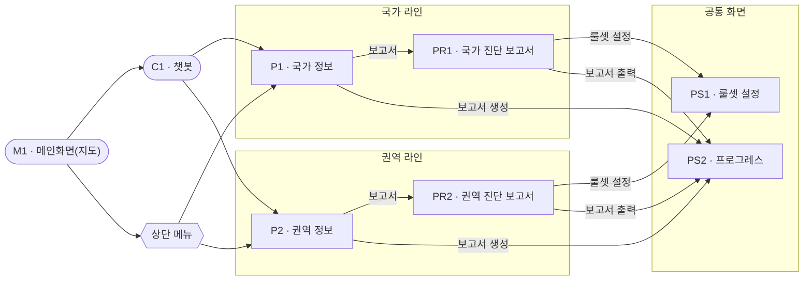
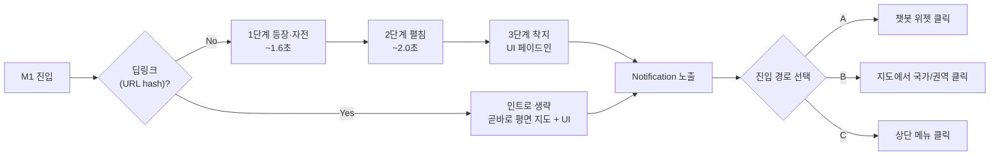
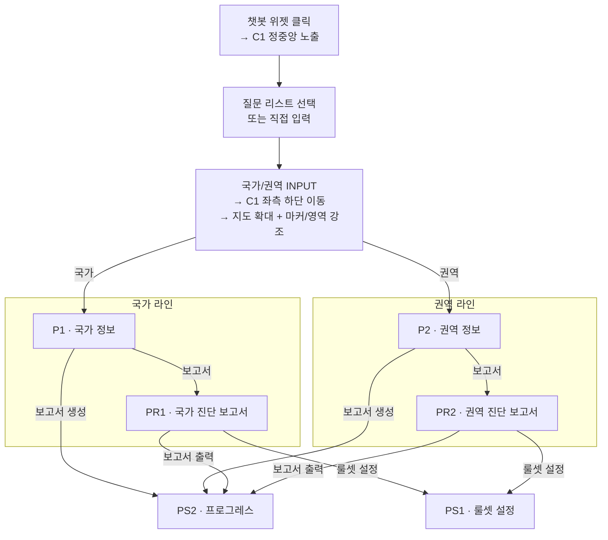
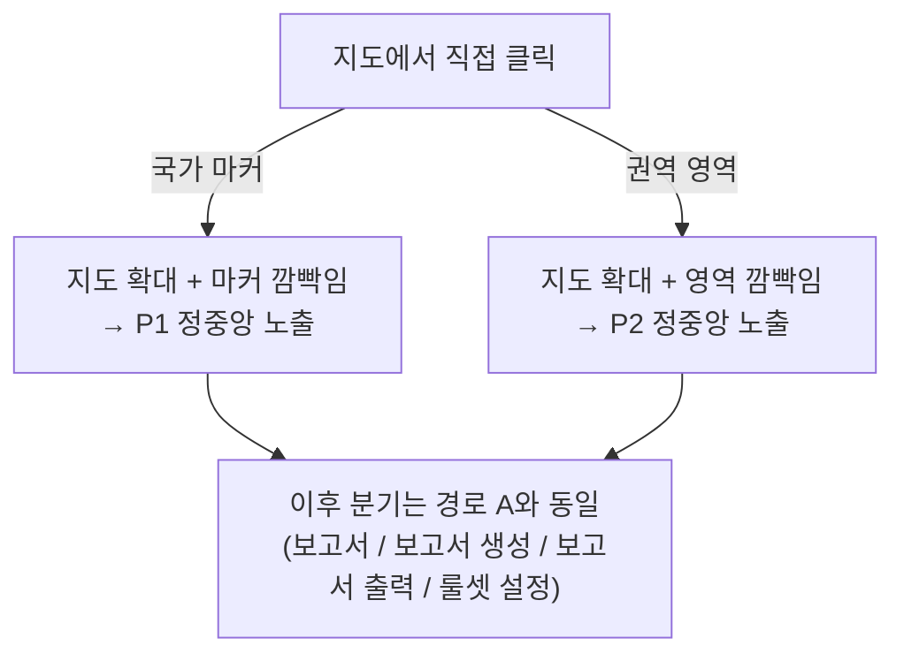
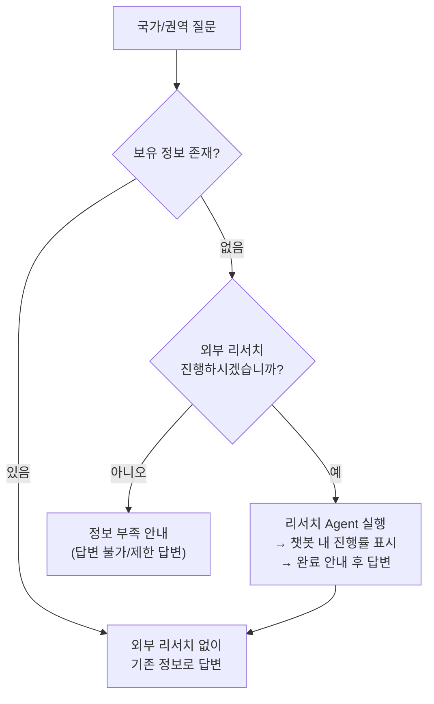
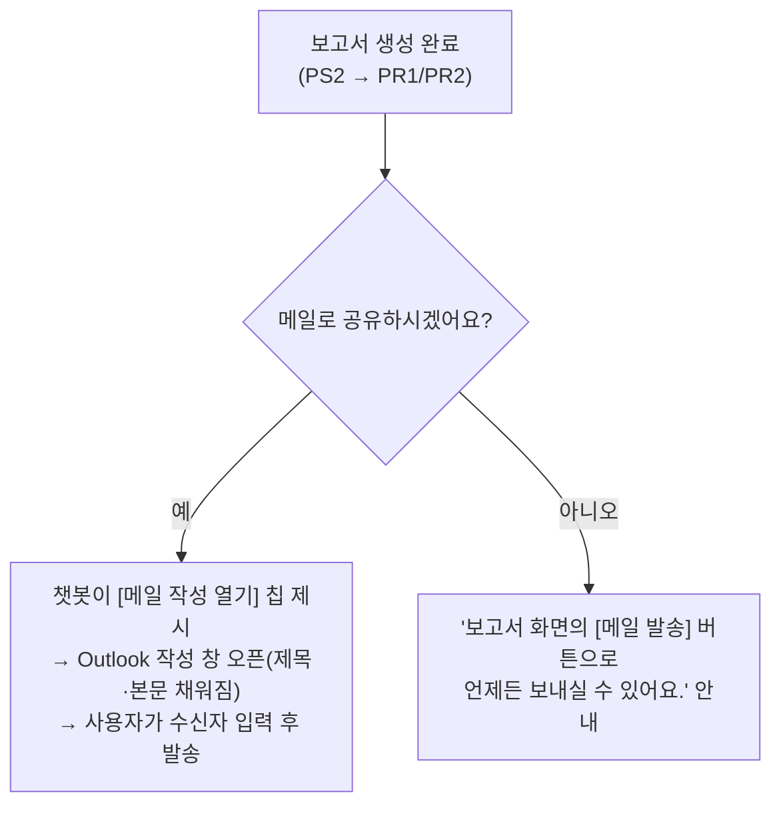

# 웹 디자인 가이드

본 문서는 글로벌 진출 진단 서비스 웹 화면의 디자인·UX 명세를 정의한다.

- [1. 참조 (Reference)](#1-참조-reference)
- [2. 화면 목록 (Screen Inventory)](#2-화면-목록-screen-inventory)
- [3. 화면 관계도 (Navigation Map)](#3-화면-관계도-navigation-map)
- [4. 화면별 상세 명세](#4-화면별-상세-명세)
- [5. 공통 규칙](#5-공통-규칙)
- [6. 화면 흐름 (User Flow)](#6-화면-흐름-user-flow)

---

## 1. 참조 (Reference)

- 디자인 스킬(레포 vendored, `.claude/skills/`): `frontend-design`(구현 충실도·품질 게이트, 출처 <https://github.com/anthropics/skills>), `ui-ux-pro-max`(접근성·차트 등 검증·보강, 출처 <https://github.com/nextlevelbuilder/ui-ux-pro-max-skill>). 두 스킬은 디자인을 생성하지 않으며 아래 토큰·mockup이 source of truth.
- 전체 디자인·색감: <https://about.hyundaicapital.com/au/cintd/IRAUCI0101.hc> 참조 (+ 현대캐피탈 CI 로고 사용)
- 색상 토큰: `../stitch/DESIGN.md` (Kinetic Enterprise 팔레트)
- 메인 화면 3D 지구본 인트로 연출 구현 상세: `intro_spec.md`

---

## 2. 화면 목록 (Screen Inventory)

| ID | 화면명 | 유형 | 기본 사이즈 | 주요 진입 경로 |
|----|--------|------|------------|----------------|
| M1 | 메인화면 (지도) | 베이스 | 풀스크린 | 앱 진입 |
| C1 | 챗봇 | 팝업 | 중간 (좌우·상하 50% 제외) | 챗봇 위젯 버튼 |
| P1 | 국가 정보 | 팝업 / 풀사이즈 | 좌우·상하 20% 제외 | 챗봇 · 지도 선택 · 메뉴 |
| P2 | 권역 정보 | 팝업 / 풀사이즈 | 좌우·상하 20% 제외 | 챗봇 · 지도 선택 · 메뉴 |
| PR1 | 국가 진단 보고서 | 팝업 / 풀사이즈 | 좌우·상하 20% 제외 | P1 · 챗봇 · 메뉴 |
| PR2 | 권역 진단 보고서 | 팝업 / 풀사이즈 | 좌우·상하 20% 제외 | P2 · 챗봇 · 메뉴 |
| PS1 | 룰셋 설정 | 팝업 / 풀사이즈 | 좌우·상하 20% 제외 | PR1 · PR2 · 메뉴 |
| PS2 | 프로그레스 | 팝업 | 중앙 (병렬 바 구성) | 보고서 생성 트리거 |

> 사이즈 표기는 "메인화면(M1) 기준 좌우/상하 여백 비율을 제외한 영역"을 의미한다. P1·P2·PR1·PR2·PS1은 진입 경로에 따라 팝업 또는 풀사이즈로 노출된다([5.1 화면 진입 모드](#51-화면-진입-모드) 참조).

---

## 3. 화면 관계도 (Navigation Map)

국가 라인과 권역 라인을 좌우 평행으로 분리해 표현한다. PS1·PS2는 양쪽 라인이 공유한다.

> 상단 메뉴는 위 다이어그램의 P1·P2 외에 PR1·PR2·PS1로도 바로 진입할 수 있다(보고서·설정 단축 진입). 세부 경로는 [6.4 경로 C](#64-경로-c--상단-메뉴를-통한-진입-풀사이즈-모드) 참조.

---

## 4. 화면별 상세 명세

### M1 · 메인화면 (지도)

- 인터랙티브 지도가 꽉차도록 구성
  - 별도 팝업이 노출된 상태일 땐 지도 반투명, 그 외에는 국가/권역이 잘 구분되도록 선명하게 구성
- 진입 시 시네마틱 인트로 시퀀스 자동 재생 (상세 구현은 `intro_spec.md` 참조) → [6.1 진입 & 인트로](#61-공통-진입--인트로-시퀀스)
- 지도 비주얼: 라이트 테마(화이트~라이트그레이 배경, `../stitch/DESIGN.md` 팔레트), 육지는 딥 네이비(primary-container `#003478`), 경계선은 같은 계열 진한 반투명(흰선 회피), 바다는 육지보다 밝게 처리(primary-fixed 계열). 상세 토큰은 `../stitch/DESIGN.md` / `intro_spec.md` 참조
- 인트로 이후 인터랙션: 드래그(구체 회전 / 평면 패닝), 휠 줌(배율 1~6), 국가·권역 포커스 시 해당 지점으로 줌·회전 + 하이라이트, 리셋 시 전체 보기 복귀
- **상단 바**
  - 중앙: 현대캐피탈 CI 로고와 "Hyundai Capital" 타이틀 중앙 정렬
  - 우측: 한/영 번역 버튼, 톱니바퀴 모양의 설정 버튼만 존재
  - 좌측: 메뉴 드롭다운 (아래 참조)
- **메뉴 드롭다운** (최상단 좌측, 햄버거 또는 menu 아이콘)
  - Default는 히든(접힌 상태), 사용자가 직접 클릭 시에만 확장
  - 컴팩트한 사이즈로 구성하여 지도 시야를 가리지 않도록 함
  - 펼쳐졌을 때도 과하게 눈에 띄지 않도록 처리(반투명/은은한 배경, 절제된 그림자, 지도 위 오버레이 형태)
  - 외부 클릭 또는 재클릭 시 다시 히든 처리
  - 메뉴 항목 구성

    | 메뉴 | 이동 화면 |
    |------|-----------|
    | 진출현황 | 메인화면 (M1) |
    | 국가 | 국가 정보 화면 (P1) |
    | 권역 | 권역 정보 화면 (P2) |
    | 보고서 | 하위로 국가/권역 선택 노출 → 국가 선택 시 PR1 / 권역 선택 시 PR2 |
    | 설정 | 룰셋 설정 화면 (PS1) |

  - 메뉴를 통해 진입하는 화면(P1, P2, PR1, PR2, PS1)은 팝업이 아니라 메인 성격의 **풀사이즈 화면**으로 노출 ([5.1 화면 진입 모드](#51-화면-진입-모드) 참조)
- **Notification 메시지** (지도 상단)
  - 문구: "챗봇을 통해 질문을 하시거나 지도의 권역이나 국가를 선택하여 상세 정보를 확인할 수 있습니다."
  - 사용자가 챗봇 버튼을 클릭하거나 지도에서 권역/국가를 선택하면 메시지 사라짐(페이드아웃)
- **챗봇**: 진입 시 챗봇 팝업(C1)을 자동으로 띄우지 않음. 챗봇 위젯 버튼 클릭 시에만 노출. 위젯 버튼은 화면 좌측 하단에 배치
- **지도 마커 / 범례**
  - 진출국가·진출예정국가를 마크로 지도에 표시 (진출국 = 채운 점, 진출예정국 = 점선 테두리 빈 점, 마커 발광 효과)
  - 지도 최우측 상단에 범례표시로 진출국가/진출예정국가 분류

### C1 · 챗봇 팝업

- 메인화면 좌우 사이드 50%, 상하 50%를 제외한 중간 사이즈의 팝업
- 정중앙에 대화창과 답변창 구성
- 제한된 질문 선택지는 대화창 내부에 메시지(말풍선/칩 등) 형태로 표현하여 클릭 선택

### P1 · 국가 정보

- 사이즈: 좌우·상하 20% 제외 (풀사이즈 팝업 또는 풀사이즈 화면)
- 화면 상단
  - 국기, 국가명, 국가영문명 노출
  - 최우측 [시뮬레이션] 버튼
- 화면 중간 영역
  - 진출여부, 시장, 핵심규제, 특화요건 항목 노출
  - 국가일반, 시스템 정보 등 표출
  - 표, 차트 등 적절한 데이터 시각화 필요
- 화면 최우측 하단 [보고서], [보고서 생성] 버튼

### P2 · 권역 정보

- 사이즈: 좌우·상하 20% 제외 (풀사이즈 팝업 또는 풀사이즈 화면)
- 화면 상단
  - 권역명 노출
  - 최우측 [시뮬레이션], [보고서] 버튼
- 화면 중간 영역
  - 기진출 국가 리스트 표시
  - 진출 예정 국가에 대한 quick-win scoring 순위, IT준비도, BIZ난이도, 종합점수 노출
  - 권역 기본 정보 노출
  - 표, 차트 등 적절한 데이터 시각화 필요
- 화면 최우측 하단 [보고서], [보고서 생성] 버튼

### PR1 · 국가 진단 보고서

- 사이즈: 좌우·상하 20% 제외 (풀사이즈)
- 최상단 국기, 국가명, 국가영문명 노출
  - 해당 정보 하단에 권역과 비교국 국가명 노출
- 최우측 상단: 보고서 ID, 보고서 생성일시, 비교국 스냅샷 일자 정보 노출 + 보고서 PDF 다운로드 버튼 + 메일 발송 버튼 (→ 6.6 이메일 공유 흐름)
- 중간 영역: 탭으로 구분
  - 요약, 판정근거, 비용 추정, 리스크, 가중치, 출처
  - 각 탭 영역별로 적절한 레이아웃 구성 필요

### PR2 · 권역 진단 보고서

- 사이즈: 좌우·상하 20% 제외 (풀사이즈)
- 최상단 지구본, 권역명, 권역영문명 노출 (예: 유럽(Europe) 권역 Quick-Win 분석 보고서)
- 최우측 상단: 보고서 ID, 보고서 생성일시 + 보고서 PDF 다운로드 버튼 + 메일 발송 버튼 (→ 6.6 이메일 공유 흐름)
- 중간 영역: 탭으로 구분
  - 요약, 시장, 규제, 상품, 시스템
  - 각 탭 영역별로 적절한 레이아웃 구성 필요

### PS1 · 룰셋 설정

- 사이즈: 좌우·상하 20% 제외 (풀사이즈)
- 화면 우측 상단: 가중치 룰셋 ID 드롭다운
- 화면 우측 하단: [저장] 버튼
- 총 3개 패널로 구성
  1. **카테고리 가중치** — 총 합계 100%로 표현되는 슬라이더 (왼쪽 0, 오른쪽 100%)
     - 시장 / 규제 / 환경(금융) / 시스템
  2. **임계값 신뢰도 계수** — 각 계수 0~100
     - 이식 임계 / 시스템 게이트
  3. **출처 신뢰도 계수** — 0~1.0
     - Tier 1(공식) / Tier 2(준공식) / Tier 3(참고)

### PS2 · 프로그레스

- 총 5개의 프로그레스 바가 병렬 구성 (결과 생성 영역은 상위 4개 영역과 분리 필요)
  - 시장 / 규제 / 상품 / 시스템 / 결과 생성
- 우측 하단에 [보고서 보기] 버튼 구성

---

## 5. 공통 규칙

### 5.1 화면 진입 모드

P1, P2, PR1, PR2, PS1은 동일 화면이 진입 경로에 따라 두 가지 모드로 표현된다. **두 모드는 사이즈/노출 방식만 다르고 화면 내 콘텐츠 구성은 동일**하다.

| 모드 | 진입 경로 | 노출 방식 | 닫기 |
|------|-----------|-----------|------|
| 팝업 모드 | 챗봇(C1) 흐름, 다른 팝업 내 버튼 | 기존 정의된 팝업 사이즈로 M1 지도 위에 오버레이 (지도 반투명) | 상단 우측 닫기 버튼 |
| 풀사이즈 모드 | 상단 메뉴 드롭다운 | 메인 성격의 풀사이즈 화면 (지도 오버레이가 아닌 전체 화면 점유), 상단 메뉴바 유지 | 닫기 버튼 대신 메뉴/뒤로 가기 |

### 5.2 챗봇(C1) 노출·위치

- 챗봇 팝업은 진입 시 자동 노출되지 않으며, 위젯 버튼 클릭으로 열림 (메인 진입 시 기본 노출 기준 없음)
- 챗봇 팝업이 열려 있을 때의 위치 규칙
  - 정중앙에 C1·PS2를 제외한 별도 팝업이 노출되어 있는 경우 → C1은 화면 **좌측 하단**에 위치
  - 그 외(별도 팝업 미노출)의 경우 → C1은 화면 **정중앙**에 위치

### 5.3 프로그레스 패널 / PS2

- 보고서 생성 진행 중이지 않다면 프로그레스 패널과 프로그레스 팝업(PS2)은 항상 노출하지 않음
- PS2가 화면에 활성화된 상태가 아니고 보고서 생성 진행 중인 건이 있다면, 화면 우측 상단에 별도 카드 형태의 프로그레스바 노출
  - 해당 프로그레스 패널 내에는 국가/권역 단위 정보와 전체 진행률 0~100% 표시, 상세보기 버튼 구성
  - 상세보기 클릭 시 해당 패널 축소 + 프로그레스 팝업(PS2) 화면 정중앙 노출

### 5.4 기타

- 사이드메뉴 구성 없음 (네비게이션은 상단 메뉴 드롭다운으로 대체)
- 팝업 화면 상단 우측에 닫기 버튼 구성

### 5.5 렌더 HTML embed (콘텐츠 본문)

§4의 P1/P2/PR1/PR2 "표·차트 데이터 시각화" 본문은 프론트가 직접 그리지 않고, **render 엔진이 만든 standalone HTML을 iframe으로 embed**해서 표시한다. 프론트는 그 위에 chrome(헤더·버튼·진입 모드 래핑)만 얹는다.

- **embed = iframe**: 렌더 HTML이 자체 CSS를 포함하므로 iframe으로 격리해 스타일 충돌을 차단하고 동일 HTML을 팝업/풀사이즈(§5.1) 양쪽에서 재사용한다.
- **책임 경계**: iframe 내부 = 콘텐츠 본문(표/차트/탭). iframe 바깥 프론트 chrome = 헤더(국기·국가명·보고서 메타), 닫기, 액션 버튼([보고서 생성]·[시뮬레이션]·[PDF]·[메일 발송]·[룰셋 설정]). 액션 버튼은 모두 chrome이 담당한다.
- 상세 결정·근거·시퀀스는 파이프라인 명세 [`../../PIPELINE.md` §5](../../PIPELINE.md#5-프론트엔드-표시-방식-핵심--web_design_spec-보완-지점) 참조.

---

## 6. 화면 흐름 (User Flow)

### 6.1 공통 진입 & 인트로 시퀀스

- 인트로 단계: ① 등장·자전(별이 반짝이는 화이트 배경에 3D 지구본 자전, ~1.6초) → ② 펼침(지구본이 평면 세계지도로 변형, ~2.0초) → ③ 착지(평면 지도 완성 → 범례 등 UI 페이드인 → 지도 상단 Notification 노출)
- 딥링크(URL hash) 진입 시 인트로 생략, 곧바로 평면 지도 + UI 노출
- 어느 진입 경로(A/B/C)로 진행하든 진입 시 Notification 메시지는 사라짐

### 6.2 경로 A · 챗봇을 통한 진입 (팝업 모드)

> 챗봇에서 "국가/권역 진단 보고서 보기"를 직접 선택하면 P1/P2를 거치지 않고 PR1/PR2로 바로 진입할 수도 있다.

1. 사용자가 챗봇 위젯 버튼 클릭 → 챗봇 팝업(C1) 정중앙 노출 (Notification 사라짐)
2. 챗봇에서 제한된 질문 리스트 선택 또는 직접 입력
3. 입력 내용에 따라 분기. 국가명/권역 INPUT 시 → C1이 M1 좌측 하단으로 이동(애니메이션) → 해당 지점으로 지도 점진적 확대 → 마커/영역 깜빡임 강조 → 챗봇 내 제한된 질문 리스트 선택
   - **국가**: "국가 정보 확인" → P1 정중앙 노출(마커에서 튀어나오는 애니메이션). P1 내 [보고서] → PR1, [보고서 생성] → PS2. "국가 진단 보고서 보기" → PR1 직접 노출. PR1 내 [보고서 출력] → PS2, [룰셋 설정] → PS1
   - **권역**: "권역 정보 확인" → P2 정중앙 노출. P2 내 [보고서] → PR2, [보고서 생성] → PS2. "권역 진단 보고서 보기" → PR2 직접 노출. PR2 내 [보고서 출력] → PS2, [룰셋 설정] → PS1
4. 단순 질의(정보 확인)인 경우 → [6.5 챗봇 질의응답 분기](#65-챗봇-질의응답-분기-리서치-agent) 참조

### 6.3 경로 B · 지도에서 권역/국가 직접 선택 (팝업 모드)

1. 사용자가 지도에서 국가 마커 또는 권역 영역을 직접 클릭 (Notification 사라짐)
2. 선택 대상에 따라 분기
   - **국가 선택** → 해당 국가 지점으로 지도 점진적 확대 → 마커 깜빡임 강조 → 국가 정보 팝업(P1) 정중앙 노출(마커에서 튀어나오는 애니메이션)
   - **권역 선택** → 해당 권역 지점으로 지도 점진적 확대 → 권역 라인/범위 깜빡임 강조 → 권역 정보 팝업(P2) 정중앙 노출
3. 이후 세부 분기(보고서/보고서 생성/보고서 출력/룰셋 설정)는 [경로 A](#62-경로-a--챗봇을-통한-진입-팝업-모드)의 P1/P2/PR1/PR2 분기와 동일

### 6.4 경로 C · 상단 메뉴를 통한 진입 (풀사이즈 모드)

1. 사용자가 최상단 좌측 메뉴 드롭다운 클릭 → 메뉴 확장 (Notification 사라짐)
2. 메뉴 항목 선택에 따라 분기 ([5.1 화면 진입 모드](#51-화면-진입-모드)의 풀사이즈 모드로 노출)

| 메뉴 | 진입 화면 | 화면 내 분기 |
|------|-----------|--------------|
| 진출현황 | M1 복귀 (전체 지도 보기) | — |
| 국가 | P1 풀사이즈 | [보고서] → PR1, [보고서 생성] → PS2 |
| 권역 | P2 풀사이즈 | [보고서] → PR2, [보고서 생성] → PS2 |
| 보고서 | 하위 국가/권역 선택 | 국가 선택 → PR1 / 권역 선택 → PR2 (풀사이즈) |
| 설정 | PS1 풀사이즈 | [저장] 시 변경된 가중치 룰셋 반영 |

### 6.5 챗봇 질의응답 분기 (리서치 Agent)

특정 국가/권역에 대한 단순 질의 시, 보유 정보 유무에 따라 외부 리서치 Agent 실행 여부가 결정된다.

**6.5.1 특정 국가에 대한 질문**

- 국가 정보 있음 → 외부 리서치 없이 기존 정보로 답변
- 국가 정보 없음 → "외부 리서치를 통해 정보 생성할지" 질문
  - 예 → 리서치 Agent 실행 → 챗봇 내 진행률 표시 → 완료 시 "해당 국가의 정보 생성이 완료되었습니다. 궁금한 점을 물어보세요." → 기존 정보로 답변
  - 아니오 → "해당 권역의 정보가 존재하지 않아 답변하기 어렵습니다." 답변
- (권역 정보 유무와 무관하게 위 국가 정보 기준으로 판단)

**6.5.2 특정 권역에 대한 질문**

- 권역 정보 있음 → 확인이 필요한 국가명을 사용자에게 질의
  - 기존에 있는 국가만 입력 → 외부 리서치 없이 기존 정보로 답변
  - 데이터 없는 국가 포함 → "일부 국가의 정보가 부족하여 외부 리서치가 필요합니다. 진행하시겠습니까?" 질의
    - 예 → 리서치 Agent 실행 → 진행률 표시 → 완료 시 "선택하신 권역과 해당 권역 내 선택한 국가들의 정보 생성이 완료되었습니다. 궁금한 점을 물어보세요." → 기존 정보로 답변
    - 아니오 → "정보가 있는 국가들에 한해서만 답변이 가능합니다. 궁금한 점을 물어보세요." → 기존 정보로 답변
- 권역 정보 없음 → "해당 권역의 정보가 부족하여 외부 리서치가 필요합니다. 진행하시겠습니까?" 질의
  - 예 → 리서치에 포함할 국가명 리스트를 사용자에게 질의 → 리서치 Agent 실행 → 진행률 표시 → 완료 시 "선택하신 권역과 해당 권역 내 선택한 국가들의 정보 생성이 완료되었습니다. 궁금한 점을 물어보세요." → 기존 정보로 답변
  - 아니오 → "정보가 있는 권역만 답변이 가능합니다." 답변

### 6.6 보고서 이메일 공유 흐름 (mailto: / Outlook 클라이언트 연동)

진단 보고서(PR1 국가 / PR2 권역)를 이메일로 공유한다. 진입점은 **(A) 보고서 화면의 [메일 발송] 버튼**과 **(B) 챗봇의 보고서 생성 완료 시점 질의** 두 가지다.

**발송 방식**: 서버가 직접 보내지 않고 `mailto:` URL로 사용자의 메일 클라이언트(Outlook 등) 작성 창을 **수신자·제목·본문이 채워진 상태로 연다**. 사용자가 본인 계정으로 발송한다. 앱은 이메일 주소를 **수집·저장하지 않는다**.

**mailto: URL 구성**

- `subject`: `[Silk Road] {권역/국가명} 진출 진단 보고서 — {보고서 ID}`
- `body` (encodeURIComponent 인코딩): 보고서 요약(판정/핵심 점수 1~2줄) + **보고서/PDF 접근 링크** + "PDF가 필요하면 다운로드 후 첨부해 주세요" 안내. 본문은 ~2000자 이내로 간결하게 구성.
- `to`: 비워둠 (사용자가 클라이언트에서 직접 입력).
- 본문에 채울 메타(보고서 ID·생성일시·권역/국가명·요약 점수)는 리포트 JSON에서 읽어 프론트가 인코딩.

**제약**

- `mailto:`는 파일 **첨부를 지원하지 않는다.** PDF는 본문에 링크로 제공하고, 첨부 안내 문구를 함께 넣는다.
- URL 길이 제한(~2000자, 클라이언트별 상이)이 있으므로 본문은 요약 + 링크 중심으로 둔다.

**(B) 챗봇 완료 시점 흐름**

§6.5의 예/아니오 칩 패턴과 동일하게 처리한다.

- 예 → 챗봇이 mailto 링크를 칩/버튼([메일 작성 열기])으로 제시 → 클릭 시 작성 창 오픈 → 완료 시 "메일 작성 창을 열었습니다. 수신자를 입력하고 보내주세요." 안내
- 아니오 → "필요하시면 보고서 화면의 [메일 발송] 버튼으로 언제든 보내실 수 있어요." 안내
- 챗봇은 직접 발송하지 않고 **mailto 링크 제시까지**가 역할(발송은 클라이언트에 위임).
